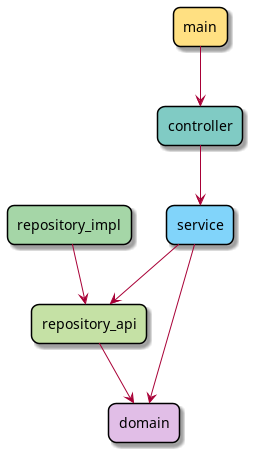

# calculator-tutorial

This project aims to teach how to implement a calculator basing on the 
io.github.fistach.archetypes:java-cli-clean-architecture-archetype.

This tutorial shows how to implement the application from the most
inside module to the outer ones. It can only be done if the domain
is known from the start, like in case of the calculator.

The logic of the application is to ask for user input and calculate
basic mathematical operations.

Module dependencies are shown in the picture.



## How to use the tutorial

Commits in the repository show how to implement a simple calculator 
as an application split into clean architecture modules. 
Check the commits one by one to track the history of implementation.
See the changes they introduce - notice which modules are being
changed.

## Methodology

The application was implemented by writing the tests first and commits
with the tests are done separately from commits containing the logic.

## Implementation history 

First commits were done in the service module. They added the core logic of this 
application - performing math operations on numbers. It was created by writing
the tests first, so test coverage is 100%.

Next commits added the controller logic - receiving the input in raw form
and converting it to the model that service requires.

Next, the main Application class was implemented. Main module is 
responsible for handling the CLI, so the interaction with the user.

Now it was time to pass the information back to the user, so 
the controller was adapted to pass the result to the main module,
and main module was updated to print the result.

In the first version no code was required in the repository module,
because the data are given from the user via the console.

## Running the app

Build the app and run it from the jar.

```bash
cd calculator
mvn package
java -jar calculator-main/target/calculator-main-<version>.jar 
```
